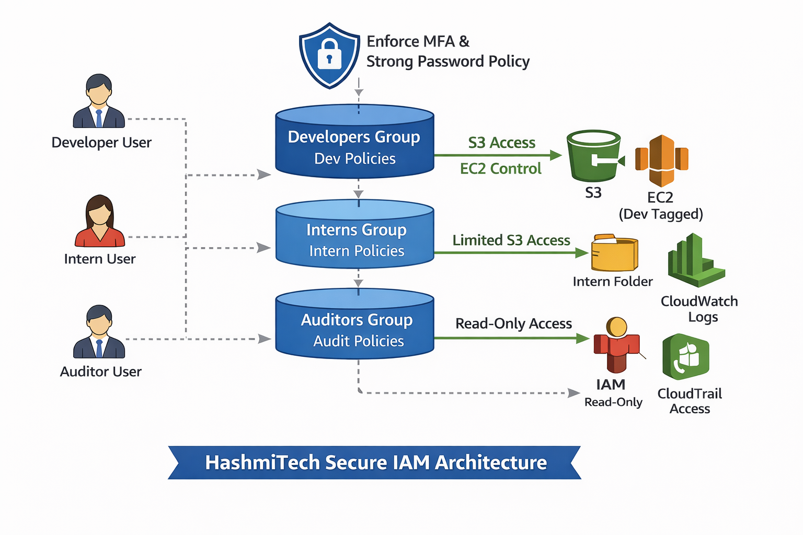

# AWS IAM Secure Multi-Role Architecture (HashmiTech)

## 📌 Project Overview

This project demonstrates how to design and implement a secure AWS IAM architecture for a small company using:

- IAM Users
- IAM Groups
- Custom Policies (Least Privilege)
- MFA Enforcement
- Tag-Based Access Control
- CloudTrail for auditing

The goal of this project is to simulate a real-world secure AWS account structure suitable for production environments.

---

## 🏗 Architecture Diagram

---

## 👥 User Roles Designed

### 1️⃣ Developers
- Access to S3 dev bucket
- CloudWatch Logs access
- Start/Stop EC2 (only instances tagged `Environment=Dev`)
- No IAM management permissions

---

### 2️⃣ Interns
- Read/Write access ONLY inside `intern-uploads/` folder
- Explicitly denied object deletion
- No access to other folders or buckets

---

### 3️⃣ Auditors
- Read-only IAM access
- Read-only CloudTrail access
- Read-only AWS Config access
- No modification privileges

---

## 🔐 Security Controls Implemented

- Root account MFA enabled
- Strong IAM password policy enforced
- Custom MFA Enforcement Policy (Condition-based)
- Explicit Deny for sensitive actions
- Tag-based EC2 control
- CloudTrail enabled for monitoring and auditing

---

## 🏷 Resources Created

### S3
- Bucket: `hashmitech-dev-bucket`
- Folder: `intern-uploads/`

### IAM Groups
- Developers
- Interns
- Auditors

### IAM Policies
- HashmiTech-EnforceMFA
- HashmiTech-Developers
- HashmiTech-Interns
- HashmiTech-Auditors

### Monitoring
- CloudTrail Trail: `hashmitech-trail`

---

## ⚙️ Implementation Steps

1. Enabled MFA on Root Account
2. Configured IAM Password Policy
3. Created IAM Groups
4. Created Custom JSON Policies
5. Attached Policies to Groups
6. Created IAM Users and added to groups
7. Created S3 bucket and intern folder
8. Launched EC2 instance with tag `Environment=Dev`
9. Enabled CloudTrail
10. Performed permission-based testing

---

## 🔐 Administrative Separation

Root account was used only for:
- Initial MFA setup
- Password policy configuration
- IAM admin creation

All operational resources were provisioned using an IAM Administrator user following AWS security best practices.

## 🧪 Test Scenarios & Expected Results

### ✅ Developers
- Can upload/download objects in dev S3 bucket
- Can start/stop EC2 only if tagged `Environment=Dev`
- Cannot access IAM dashboard
- Cannot modify users or policies

---

### ✅ Interns
- Can upload/download only in `intern-uploads/`
- ❌ Cannot delete any object
- ❌ Cannot access other bucket areas

---

### ✅ Auditors
- Can view IAM users and policies
- Can lookup CloudTrail events
- Cannot create, update, or delete resources

---

## 📸 Evidence

Screenshots available in `/screenshots` folder:

- dev-iam-denied.png
- intern-delete-blocked.png
- auditor-cloudtrail-view.png
- mfa-enforcement-test.png

---

## 💡 Architecture Decisions

### Why group-based instead of direct user policy?
Using IAM groups keeps permission management scalable and structured. Instead of attaching policies directly to each user, users inherit permissions from their group. This reduces administrative overhead and enforces consistency.

---

### Why explicit deny?
Explicit deny provides a strong safety mechanism. Even if an “Allow” permission exists elsewhere, the explicit deny overrides it. This prevents accidental privilege escalation (e.g., interns cannot delete objects even if additional permissions are granted later).

---

### Why tag-based EC2 access?
Tag-based access ensures developers can only control EC2 instances meant for the development environment. This protects production environments from accidental modification.

---

### Why MFA enforced via condition?
MFA enforcement improves account security. If MFA is not present, all actions are denied except MFA setup and password change. This reduces the risk of account compromise.

---

## 📚 Key Learning Outcomes

- Practical implementation of Least Privilege model
- Understanding IAM policy evaluation logic
- Using Conditions in AWS policies
- Securing AWS accounts using MFA enforcement
- Resource-level access control with tags
- Audit readiness using CloudTrail

---

## 🚀 Future Improvements

- Implement Permission Boundaries
- Add AWS Config compliance rules
- Convert architecture to Terraform IaC
- Add IAM Access Analyzer validation
- Deploy CI/CD pipeline for policy validation

---

## 🧹 Cleanup (To Avoid Charges)

1. Delete CloudTrail trail and log bucket
2. Delete S3 bucket contents and bucket
3. Delete EC2 test instances
4. Remove IAM users, groups, and policies

---

## 👨‍💻 Author

Hamzah Zubair Hashmi  
Aspiring AWS Solutions Architect  
Manchester, UK
