# AWS IAM Secure Multi-Role Architecture (HashmiTech)

## 📌 Project Overview

This project demonstrates a real-world cloud infrastructure setup using Amazon EC2, focusing on secure deployment, resource management, and operational best practices.

A virtual server (EC2 instance) is provisioned and configured with proper networking, security groups, key-based authentication, and tagging strategy. The project also includes system initialization using user data scripts, monitoring using CloudWatch, and controlled access through IAM policies.

This setup simulates a production-like environment where compute resources are securely deployed, managed, and monitored, following AWS architectural best practices.

## 🎯 Objectives

- To provision and configure an EC2 instance following AWS best practices
- To implement secure access using key pairs and security groups
- To apply tagging strategy for resource management and access control
- To configure user data scripts for automated instance setup
- To enable monitoring and logging using Amazon CloudWatch
- To restrict access using IAM roles and least privilege principles
- To understand EC2 lifecycle operations (start, stop, reboot, terminate)
- To simulate a real-world production environment for compute workloads

## 🏗 Architecture Diagram

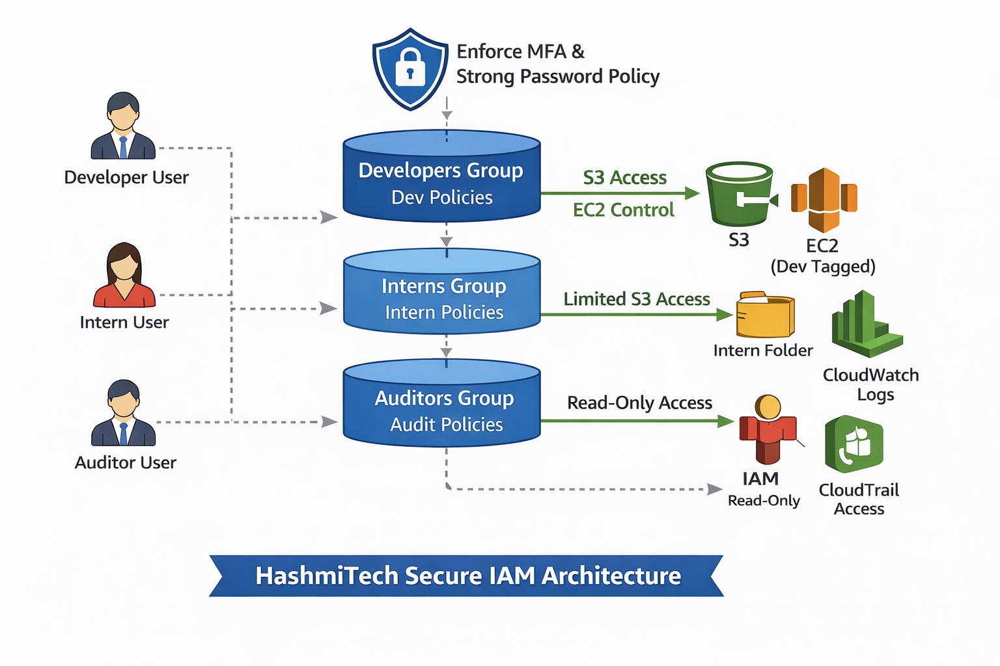

## 🔹 IAM Architecture (Flow-Chart)

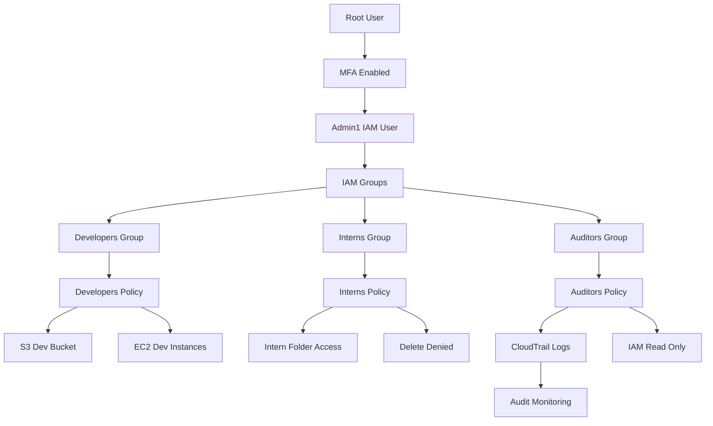
```mermaid
flowchart TB
    A[Root User] --> B[MFA Enabled]

    B --> C[Admin1 IAM User]

    C --> D[IAM Groups]

    D --> G1[Developers Group]
    D --> G2[Interns Group]
    D --> G3[Auditors Group]

    G1 --> P1[Developers Policy]
    G2 --> P2[Interns Policy]
    G3 --> P3[Auditors Policy]

    P1 --> S3[S3 Dev Bucket]
    P1 --> EC2[EC2 Dev Instances]

    P2 --> F1[Intern Folder Access]
    P2 --> D1[Delete Denied]

    P3 --> CT[CloudTrail Logs]
    P3 --> IAM[IAM Read Only]

    CT --> LOGS[Audit Monitoring]

```

# 🔐 Phase 1 – Root Account Hardening

## 1️⃣ Root MFA Enabled

To secure the AWS account, MFA was enabled on the root user.

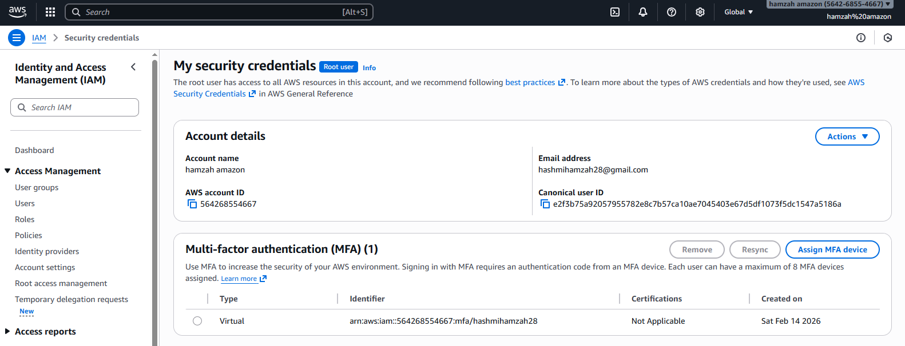

## 2️⃣ Strong Password Policy

Configured IAM password policy with:

- Minimum 12 characters
- Uppercase & lowercase required
- Numbers required
- Symbols required

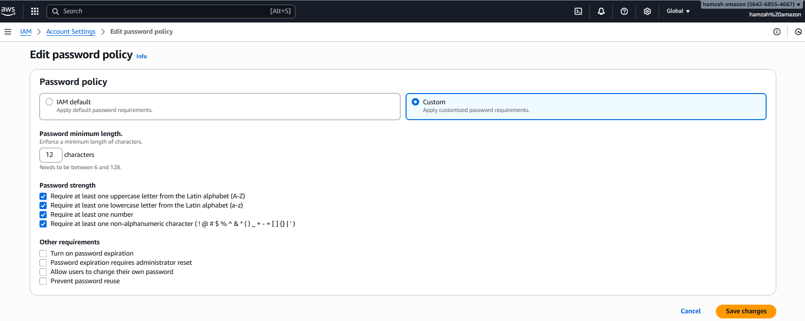

# 👤 Phase 2 – Administrative Separation

## 3️⃣ Created IAM Admin User

Created `admin1` with `AdministratorAccess` policy to avoid using root account for operations.

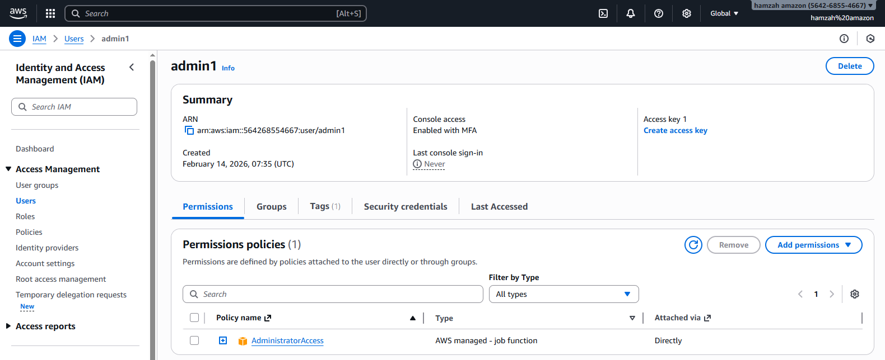

# 👥 Phase 3 – IAM Role Design

## 4️⃣ Created IAM Groups

- Developers
- Interns
- Auditors

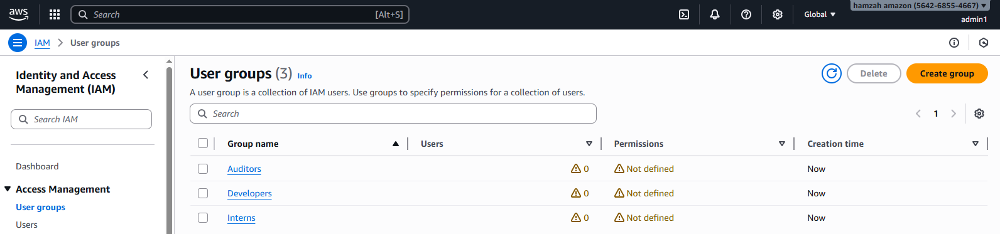

## 5️⃣ Created Custom Policies

- Hashmi-EnforceMFA
- Hashmi-Developers
- Hashmi-Interns
- Hashmi-Auditors

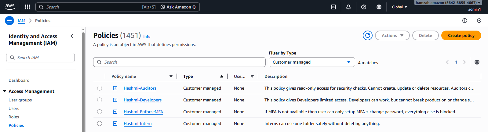

## 6️⃣ Attached Policies to Groups

### Auditors Group

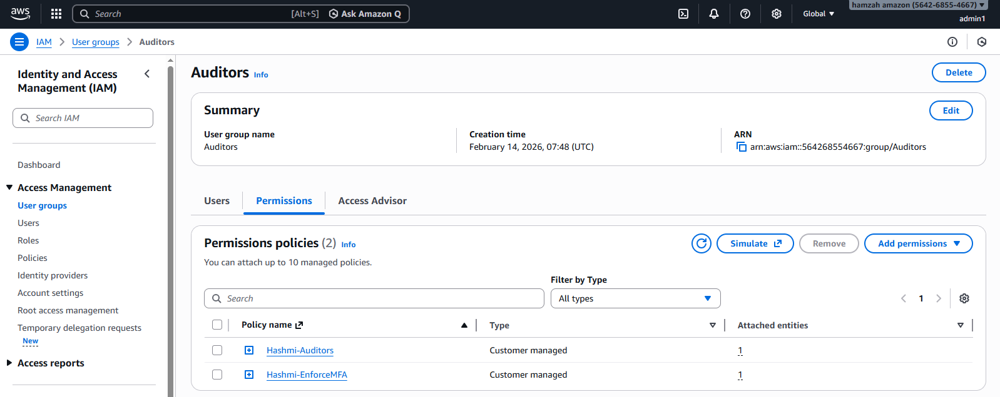

### Developers Group

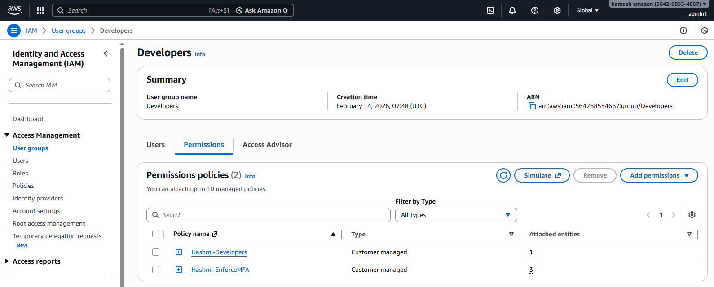

### Interns Group

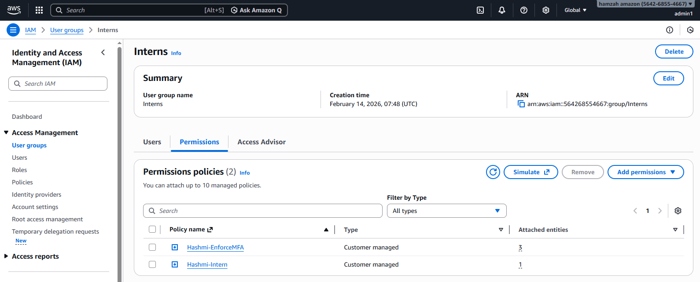

## 7️⃣ Created Users and Assigned to Groups

Users created:

- dev1, dev2 → Developers
- intern1 → Interns
- auditor1 → Auditors

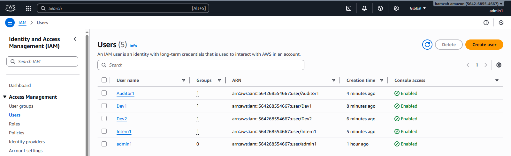

# 🗂 Phase 4 – S3 Access Control

## 8️⃣ Created S3 Bucket

Bucket: `hashmit-bucket-dev`

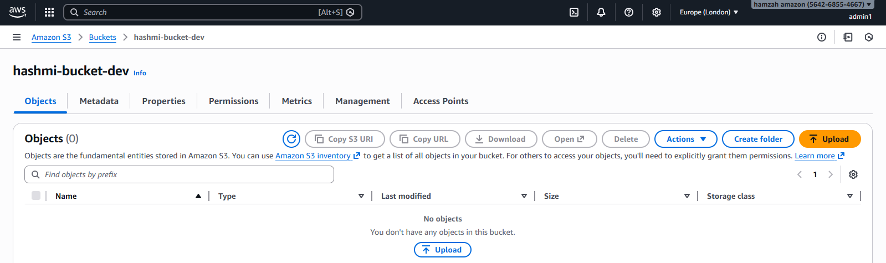

## 9️⃣ Created Secure Intern Folder

Folder: `intern-uploads/`

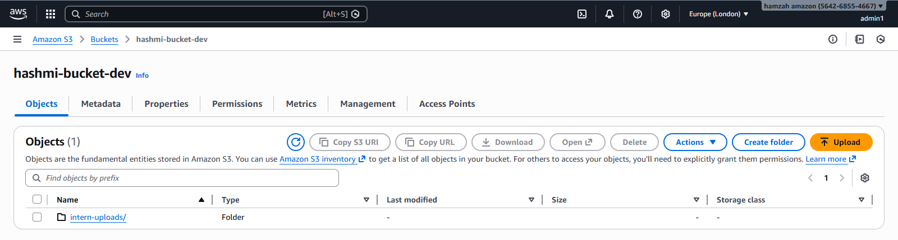

## 🔒 S3 Permission Testing

### Developer IAM Access Denied

Developers cannot access IAM dashboard.

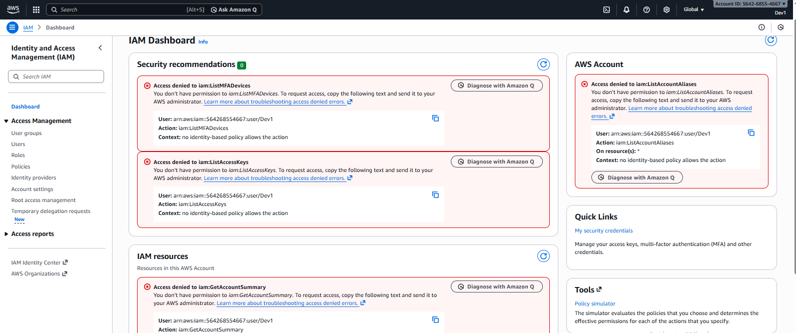

### Intern Upload Success

Intern can upload files inside allowed folder.

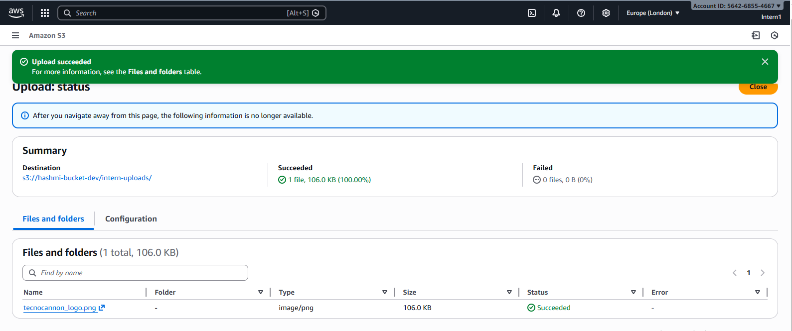

### Intern Delete Denied

Intern cannot delete objects (Explicit Deny in policy).

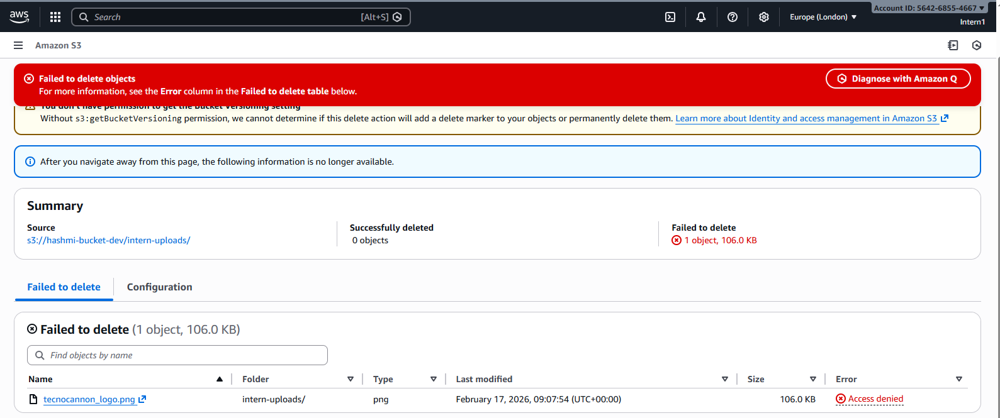

# 🖥 Phase 5 – EC2 Tag-Based Control

## 10️⃣ Tagged EC2 Instance

Key: `Environment`  
Value: `Dev`

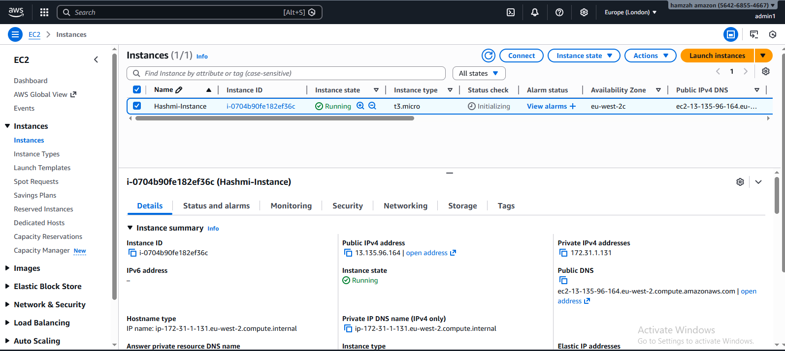

## 11️⃣ Developer Start/Stop Allowed (Only Dev Tagged)

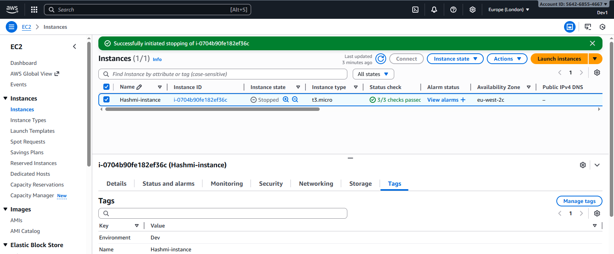

# 📊 Phase 6 – CloudTrail Monitoring

## 12️⃣ CloudTrail Enabled (Admin)

Trail: `hashmi-trail`  
Management Events: ON

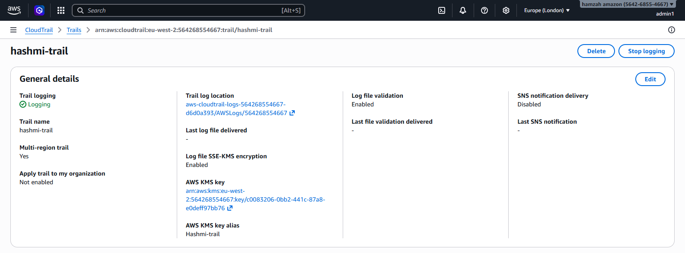

## 13️⃣ Auditor Event Lookup

Auditor can view CloudTrail logs but cannot modify resources.

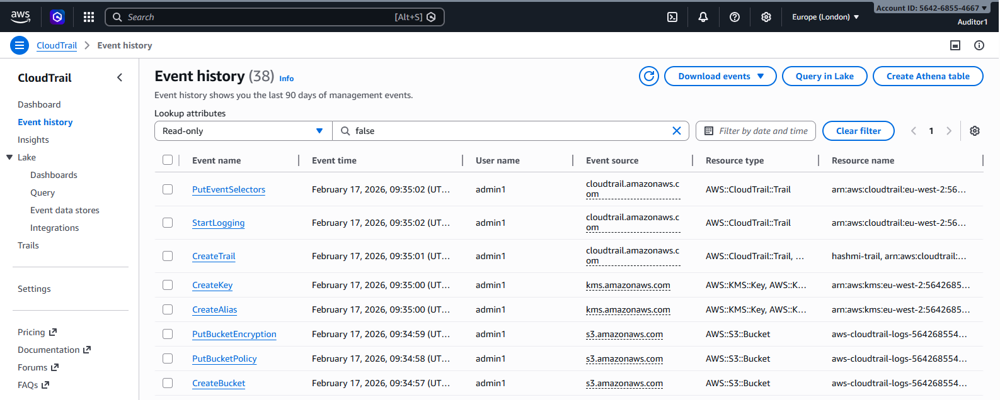

# 🧠 Architecture Decisions

## Why Group-Based Instead of Direct User Policies?

Group-based access ensures scalable permission management. Users inherit permissions automatically, reducing administrative complexity.

## Why Explicit Deny?

Explicit Deny overrides all Allow rules and prevents accidental privilege escalation (e.g., interns deleting data).

## Why Tag-Based EC2 Access?

Developers can only operate on EC2 instances tagged `Environment=Dev`, protecting production workloads.

## Why MFA Enforcement Using Condition?

If MFA is not present, access is denied except for MFA setup. This ensures strong authentication protection.

# 🔐 Administrative Model

Root account used only for:

- Initial MFA setup
- Password policy configuration
- Creating IAM admin user

All operational tasks were performed using IAM admin account.

# 📚 Key Learning Outcomes

- IAM Policy Structure & Evaluation Logic
- Condition-Based Access Control
- Resource-Level Permission Enforcement
- AWS Console Permission Dependencies
- CloudTrail Audit Monitoring
- Enterprise-Level IAM Design Principles

# 🚀 Future Improvements

- Implement Permission Boundaries
- Convert IAM structure to Terraform (IaC)
- Implement AWS Config compliance checks
- Add Service Control Policies (SCP) for multi-account setup
- Implement CI/CD for policy validation

# 🧹 Cleanup Steps

1. Delete CloudTrail trail and log bucket
2. Terminate EC2 instance
3. Delete S3 bucket contents
4. Remove IAM users and groups

## 👨‍💻 Author

Hamzah Zubair Hashmi  
Aspiring AWS Solutions Architect  
Manchester, UK
